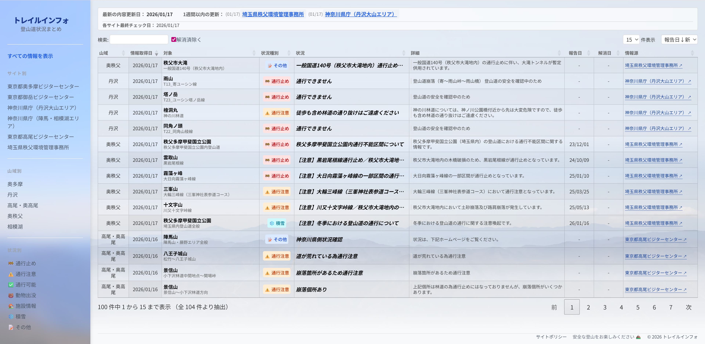
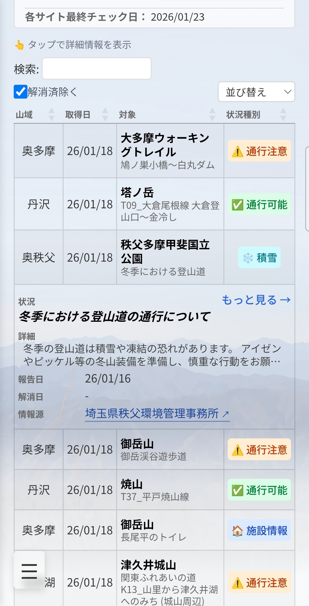

# Trail Condition Portal

## 概要

地方自治体、省庁等の公式サイトに散在する登山道の危険情報を自動収集し、一元的に閲覧できるサービスです。

**解決する課題**
- 登山道の危険情報は複数の公的機関サイトに分散している
- 各サイトの形式がバラバラで、必要な情報を探すのに時間がかかる
- 更新頻度や情報の鮮度がわかりにくい

サービスURL: 
**https://trail-info.jp/**

## スクリーンショット

<p>
  
  
</p>

## このサービスの効果
1. **登山者側**
  - 複数サイトを巡回する手間が不要
  - 統一フォーマットで比較しやすい
  - 危険情報の見落としリスクが減る
2. **情報源サイト側**
  - 自分たちが発信した情報がより多くの登山者に届く
  - trail-info.jpからのリンクで公式サイトへの流入が期待できる
  - 個別サイトでは実現困難な「横断検索・比較」が可能になる

## 特徴

- **自動収集**: 公的機関サイトを定期的にスクレイピングし、最新情報を取得
- **AI構造化**: LLM（Gemini/DeepSeek/GPT）が非構造化テキストから山名・登山道名・状況等を抽出
- **名寄せ処理**: RapidFuzz + SudachiPyによるテキスト類似度計算で、同一情報の重複を防止
- **コスト最適化**: SHA-256ハッシュによる変更検知で、更新があった情報源のみAI処理

## データフロー

```
公的機関サイト → スクレイピング → 変更検知 → AI構造化 → レコード照合 → DB保存 → Web表示
```

## 技術スタック

| レイヤー | 技術 |
|---------|------|
| Backend | Django 6.0, PostgreSQL |
| Frontend | Tailwind CSS 4.x, Vite |
| Data Collection | httpx, trafilatura |
| AI Processing | Gemini API, DeepSeek API, OpenAI API, Pydantic |
| Text Matching | RapidFuzz, SudachiPy |
| Infrastructure | Cloud Run, Supabase, Cloudflare, Docker |

## 実装の背景
**https://zenn.dev/d3c0b/articles/ffba1788c2168e**

## 参考文献

- [trafilatura](https://trafilatura.readthedocs.io/) - Web content extraction
- [RapidFuzz](https://rapidfuzz.github.io/RapidFuzz/) - Fuzzy string matching
- [SudachiPy](https://github.com/WorksApplications/SudachiPy) - Japanese morphological analyzer

---

© 2026 HiroItozzz. All rights reserved.
