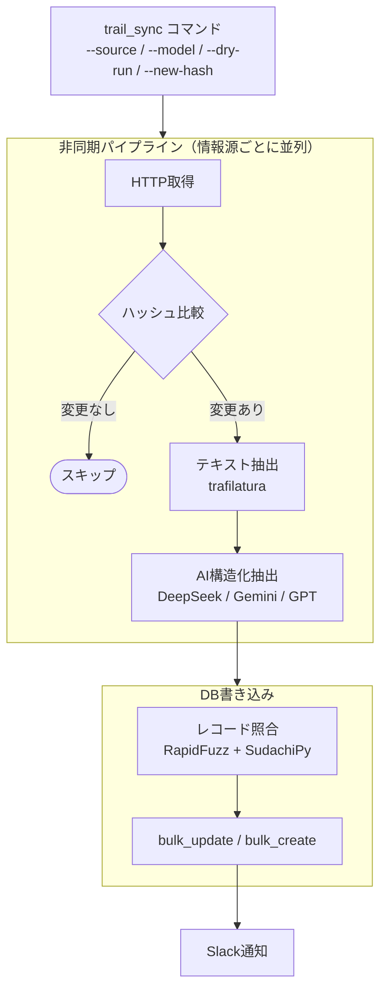

# メイン処理パイプライン

```mermaid
flowchart TB
    CLI["trail_sync コマンド<br>--source / --model / --dry-run / --new-hash"]
    CLI --> PIPELINE

    subgraph PIPELINE["非同期パイプライン（情報源ごとに並列）"]
        FETCH["HTTP取得"] --> HASH{"ハッシュ比較"}
        HASH -- 変更なし --> SKIP([スキップ])
        HASH -- 変更あり --> TEXT["テキスト抽出<br>trafilatura"]
        TEXT --> LLM["AI構造化抽出<br>DeepSeek / Gemini / GPT"]
    end

    LLM --> DB

    subgraph DB["DB書き込み"]
        MATCH["レコード照合<br>RapidFuzz + SudachiPy"] --> SAVE["bulk_update / bulk_create"]
    end

    SAVE --> SLACK["Slack通知"]
```
