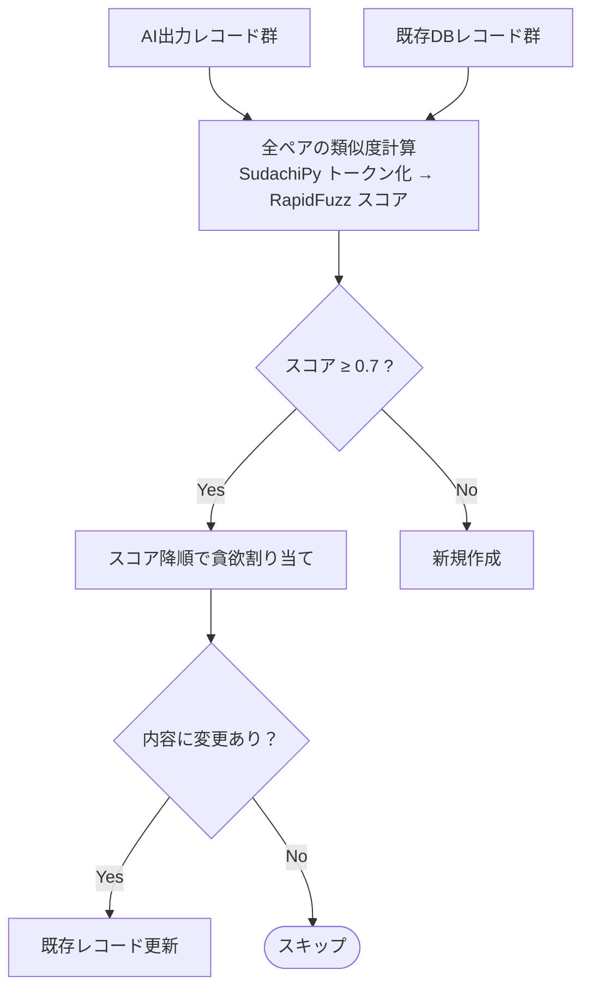

# レコード照合アルゴリズム

## フィールド重み

| フィールド | 重み | 備考 |
|:---:|:---:|:---|
| mountain | 0.2 | 名詞のみでトークン化 |
| trail | 0.3 | 全品詞 |
| title | 0.1 | 全品詞 |
| desc | 0.4 | 先頭200文字で比較 |

desc欠損時は trail:0.4 / title:0.4 に自動切替。
