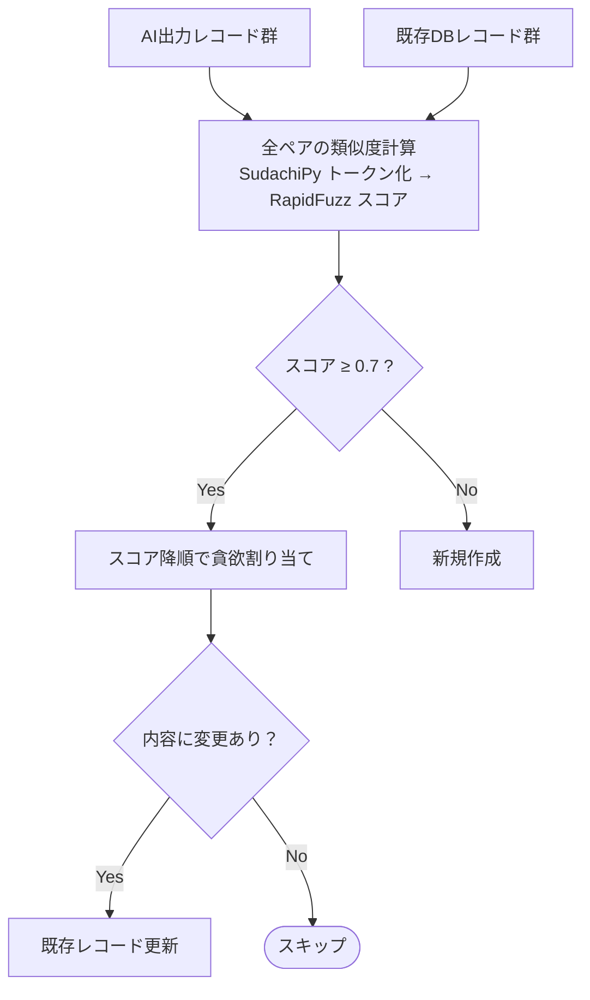

# レコード照合アルゴリズム


```mermaid
flowchart TB
    INPUT["AI出力レコード群"] --> MATRIX["全ペアの類似度計算<br>SudachiPy トークン化 → RapidFuzz スコア"]
    EXISTING["既存DBレコード群"] --> MATRIX

    MATRIX --> THRESHOLD{"スコア ≥ 0.7 ?"}
    THRESHOLD -- Yes --> GREEDY["スコア降順で貪欲割り当て"]
    THRESHOLD -- No --> CREATE["新規作成"]

    GREEDY --> CHANGED{"内容に変更あり？"}
    CHANGED -- Yes --> UPDATE["既存レコード更新"]
    CHANGED -- No --> NOOP([スキップ])
```

## フィールド重み

| フィールド | 重み | 備考 |
|:---:|:---:|:---|
| mountain | 0.2 | 名詞のみでトークン化 |
| trail | 0.3 | 全品詞 |
| title | 0.1 | 全品詞 |
| desc | 0.4 | 先頭200文字で比較 |

desc欠損時は trail:0.4 / title:0.4 に自動切替。

## 処理の流れ（`DbWriter._reconcile_records`）

1. 既存レコードのうち `disabled=False` のものを候補にする
2. 候補 × AI 出力の全ペアで類似度を計算し、`SIMILARITY_THRESHOLD`（0.7）以上のペアだけを残す
3. スコアの高い順にペアを見て、既存レコードと AI 出力のどちらもまだ使われていなければ結びつける（貪欲法）
4. 結びついたペアは、`status` か `resolved_at` が変わったときだけ更新する。title / description / reported_at / reference_url は LLM の出力の揺れが大きいため判定に使わない
5. 結びつかなかった AI 出力は新規作成する。情報源の初回（既存レコードが 0 件）のときだけ `disabled=True` で作り、人が確認してから公開する

### 取り合いの例

```
既存：X「川苔山 百尋ノ滝」
AI  ：a（X とのスコア 0.95）
      b（X とのスコア 0.80）
```

a が X と結びつき、b はしきい値以上でも取り合いに負けたため新規作成になる。結果は AI 出力を渡した順ではなく、スコアで決まる。

### 結びつかなかった既存レコード

どの AI 出力とも結びつかなかった既存レコードは、何もせずに残す（意図した挙動）。情報源のページから消えた情報も、`disabled` にするまで画面に出続ける。

### 初回の判定と `disabled` の既存レコード

初回かどうかは、`disabled` を含めた既存レコードの件数で判定する。既存レコードがすべて `disabled=True` の場合、候補は 0 件だが初回ではないため、新規作成するレコードは `disabled=False` になる。

## テストの考え方

照合のテストは 2 層に分ける。

| 層 | 確かめること | やり方 | 正解を決めるもの |
|---|---|---|---|
| A：割り当てのしくみ | 取り合いでスコアの高いほうが勝つ、しきい値未満は新規作成、`disabled` は候補にしない、初回は `disabled=True`、変更がなければ更新しない | `_calculate_similarity` を差し替え、スコアを表で決める | コードの設計 |
| B：類似度の質 | 「同じ登山道」と判定されるべきペアが 0.7 以上になるか、違うものが 0.7 未満になるか | 本物の SudachiPy + RapidFuzz に、`sample/` の実際の AI 出力から選んだペアを渡す | 山と情報源を知っている人の判断 |

A は重みやしきい値を調整しても変わらない。B は重みやしきい値、辞書を変えると結果が変わるため、調整したときの確認に使う。
